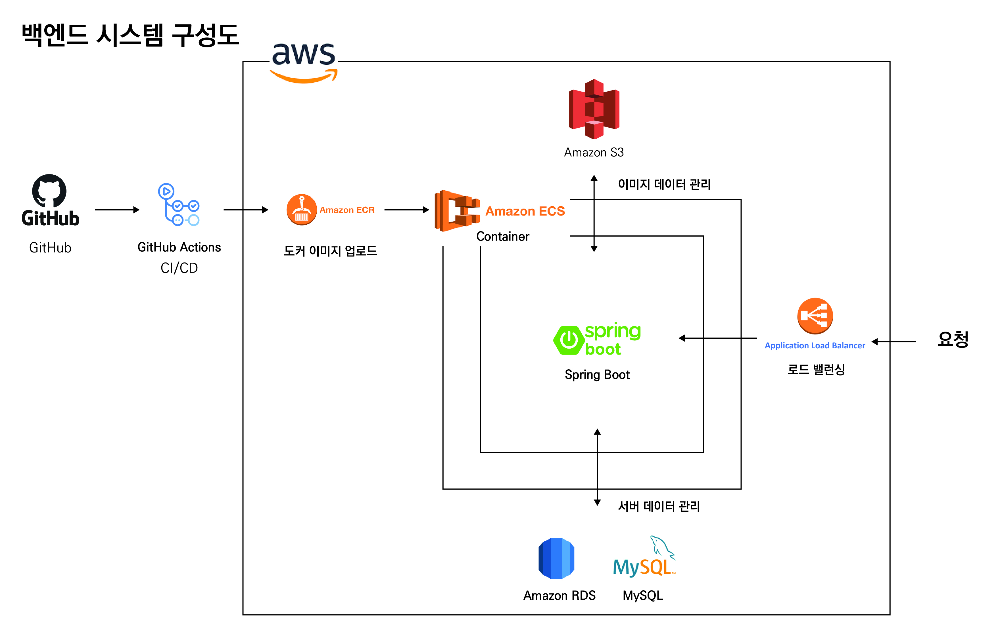
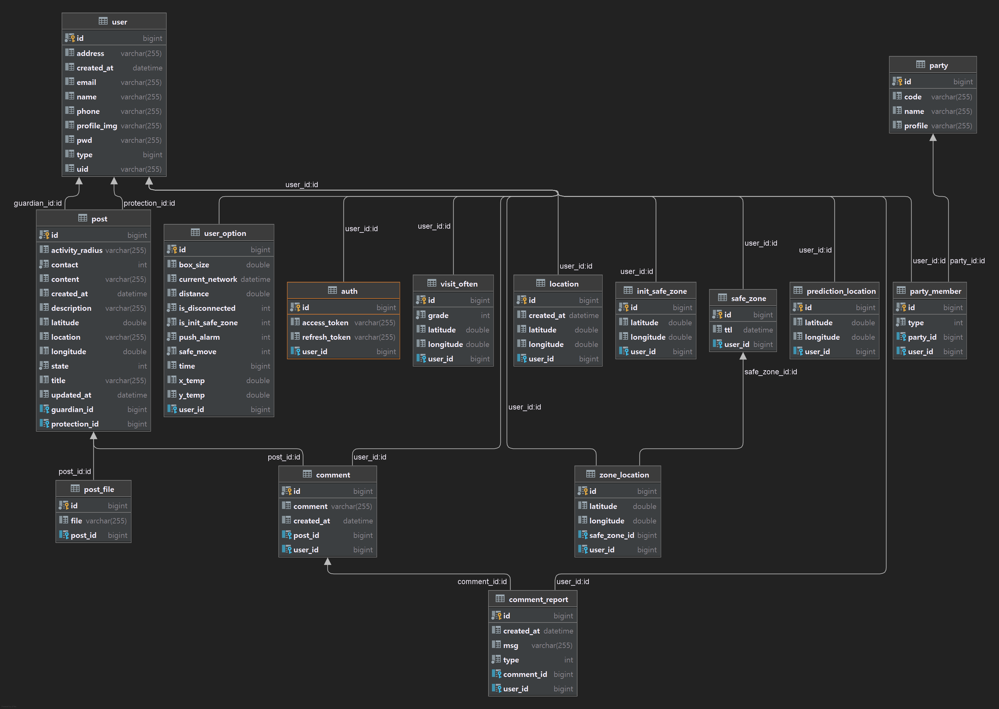

# WithMe - BackEnd

### **[데모영상](https://youtu.be/MaM2q_eAEaI)**

## 프로젝트 설명
사회적 취약계층을 보호하기 위한 거주지 이탈 방지 및 실종 범위 예측 서비스입니다.

### 주요기능
- **그룹 기능**: 피보호자와 보호자들의 그룹을 형성하여, 가족 단위의 보호 시스템을 구축할 수 있습니다.
- **피보호자 세이프존**: 초기 세이프존은 직접 지정합니다. 이후 축적되는 위치 데이터를 기반으로 동적으로 변경되는 세이프존을 갖게 됩니다.
- **세이프존 이탈 알림**: 세이프존을 이탈하게 된다면, 보호자에게 알림 메일을 보내 인지할 수 있게 도와줍니다.
- **통신두절 시 인사이트 제공**: 10분이상 위치좌표를 못받게 되면 통신 두절 상태로 들어갑니다. 이에 보호자에게 지속적인 알림을 보내며, 마지막 좌표와 속도, 시간을 토대로 최대 이동 반경과, 자주갔던 위치, 예상되는 위치를 안내합니다. 
- **공동알람 서비스**: 각 지역마다 실종자 게시판을 만들어, 동네 주민이 함께 실종자를 찾는데 기여할 수 있습니다.

## 시스템구성도

## ERD

## 기술스택
- SpringBoot 2.5.6: 백엔드 서버 프레임워크
- Spring Data JPA: 자바 진영 ORM 기술 표준
- Spring Web: REST API 작성을 위한 도구를 제공
- JUnit5: 테스트 코드 작성 도구
- JWT: 인증/인가 도구로 토큰 방식을 사용
- Google SMTP: 회원가입에서 이메일 인증을 위해 Google SMTP를 사용
- ImgScalar: 이미지 업로드, 다운로드 시, 효율성을 위해 이미지 리사이징 과정을 거침
- Redis: 자주 탐색하는 피보호자의 위치데이터를 인메모리에 저장하여 DB 접근 횟수를 줄임.
- Spring Batch: Redis를 캐시 DB로 활용하여 Batch 사이즈 만큼 모여야 DB에 Insert 명령어를 보냄. 이를 통해 성능 향상을 이끔
